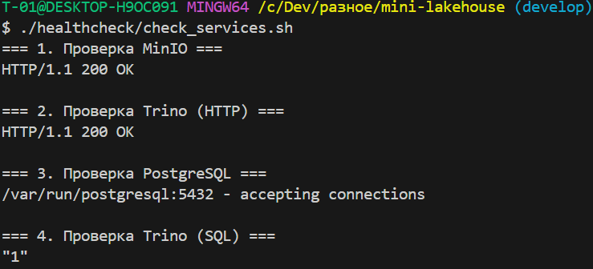
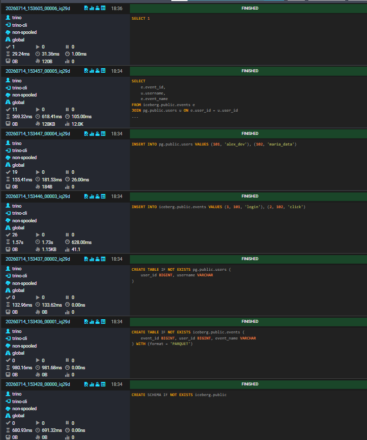
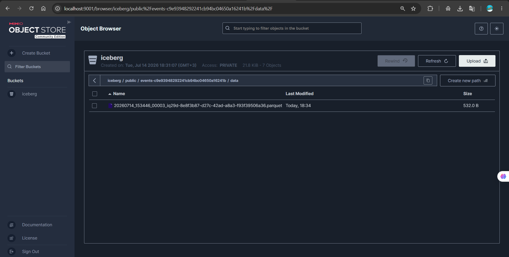

# 🌊 Mini-Lakehouse — Учебная платформа данных

[](https://www.docker.com/)
[](https://trino.io/)
[](https://iceberg.apache.org/)
[](https://min.io/)
[](https://www.postgresql.org/)

**Mini-Lakehouse** — это локальный прототип современной платформы данных, разворачиваемый в Docker. Проект демонстрирует базовые архитектурные принципы Lakehouse: разделение вычислительного слоя и слоя хранения, работу с табличным форматом, федеративные запросы и версионирование данных (Time Travel).

---

## 📖 О проекте

Проект решает задачу быстрого локального развертывания аналитической песочницы. 

Что реализовано в рамках платформы:
- 🔗 **Федеративные запросы (JOIN)** — объединение «холодных» файлов из S3-хранилища и «горячих» данных из реляционной СУБД в одном SQL-запросе.
- ⏳ **Time Travel** — обращение к историческим снапшотам данных (версионирование «из коробки» благодаря Apache Iceberg).
- 🗄️ **S3-хранилище** — локальное объектное хранилище для физических файлов таблиц (Parquet).
- 🩺 **Автоматизация проверок** — встроенные healthcheck-скрипты для контроля состояния инфраструктуры.

---

## 🛠️ Стек технологий

| Компонент | Технология | Роль в проекте |
|-----------|------------|----------------|
| **SQL-движок** | Trino | Выполнение распределенных SQL-запросов и федеративных JOIN |
| **Табличный формат** | Apache Iceberg | Описание таблиц, snapshots, time travel |
| **S3-хранилище** | MinIO | Хранение физических данных (Parquet) и метаданных файлов |
| **Метакаталог / СУБД** | PostgreSQL 15 | Iceberg JDBC-metastore и сервисная база данных |
| **Инфраструктура** | Docker Compose | Оркестрация и локальный запуск контейнеров |

---

## 🚀 Запуск проекта

### 1. Клонирование репозитория

```bash
git clone https://github.com/oayaivaivb/mini-lakehouse.git
cd mini-lakehouse

```

### 2. Запуск инфраструктуры

Поднимите сервисы в фоновом режиме:

```bash
docker compose up -d

```

*Trino требуется около 15-30 секунд для полной инициализации Java-машины.*

### 3. Проверка работоспособности (Healthcheck)

Убедитесь, что все сервисы стартовали и готовы к работе:

```bash
chmod +x healthcheck/check_services.sh
./healthcheck/check_services.sh

```


### 4. Инициализация и работа с данными

Выполните подготовленные SQL-скрипты через встроенный CLI Trino (последовательно):

```bash
# 1. Создание схемы Iceberg
cat sql/01_create_schema.sql | docker compose exec -T trino trino

# 2. Создание таблиц (в MinIO и PostgreSQL)
cat sql/02_create_tables.sql | docker compose exec -T trino trino

# 3. Вставка тестовых данных
cat sql/03_insert_data.sql | docker compose exec -T trino trino

# 4. Проверка федеративного JOIN-запроса
cat sql/04_select_join.sql | docker compose exec -T trino trino

```

---

## 🔗 Доступ к интерфейсам (UI)

После запуска контейнеров доступны следующие веб-интерфейсы:

* 🐘 **Trino UI:** [http://localhost:8080](http://localhost:8080) *(Логин: любой, например `admin`, без пароля)* — Мониторинг выполнения SQL-запросов.

* 🪣 **MinIO Console:** [http://localhost:9001](http://localhost:9001) *(Логин: `minio_admin` / Пароль: `minio_password`)* — Просмотр S3-бакетов и Parquet-файлов.


---

## 📁 Структура проекта

```text
mini-lakehouse/
├── docs/                                 # Документация проекта
│   ├── screenshots/                      # Скриншоты интерфейсов и проверок
│   │   ├── healthcheck.png
│   │   ├── minio_bucket.png
│   │   └── trino_query.png
│   └── architecture.drawio               # Схема архитектуры платформы
│   
│   
│   
├── healthcheck/
│   ├── check_services.sh                 # Баш-скрипт проверки портов и БД
│   └── check_trino.sql                   # SQL-проверка для Trino
├── postgres/
│   └── init/
│       └── 01_init_service_db.sql        # Скрипт инициализации системных таблиц Iceberg
├── sql/
│   ├── 01_create_schema.sql              # Создание namespace
│   ├── 02_create_tables.sql              # Создание таблиц (Iceberg + PG)
│   ├── 03_insert_data.sql                # Наполнение данными
│   ├── 04_select_join.sql                # Демонстрация federated JOIN
│   └── 05_time_travel.sql                # Демонстрация Time Travel
├── trino/
│   └── catalog/
│       ├── iceberg.properties            # Конфиг подключения Iceberg -> MinIO/PG
│       └── postgresql.properties         # Конфиг подключения Trino -> PG (сервисная БД)
├── docker-compose.yml                    # Манифест инфраструктуры
└── README.md                             # Описание проекта

```

